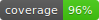
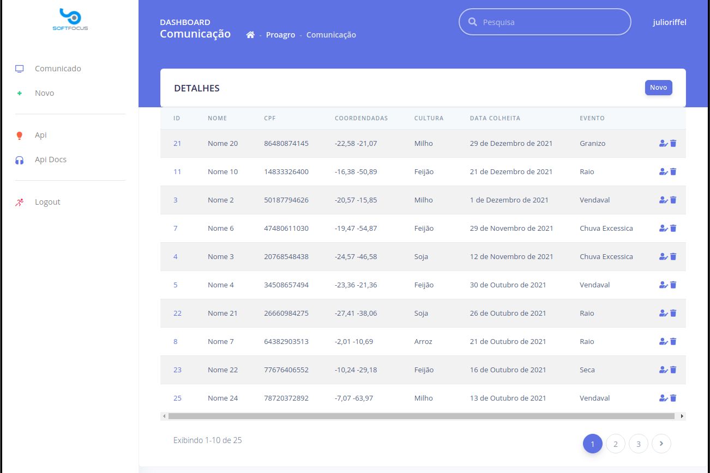
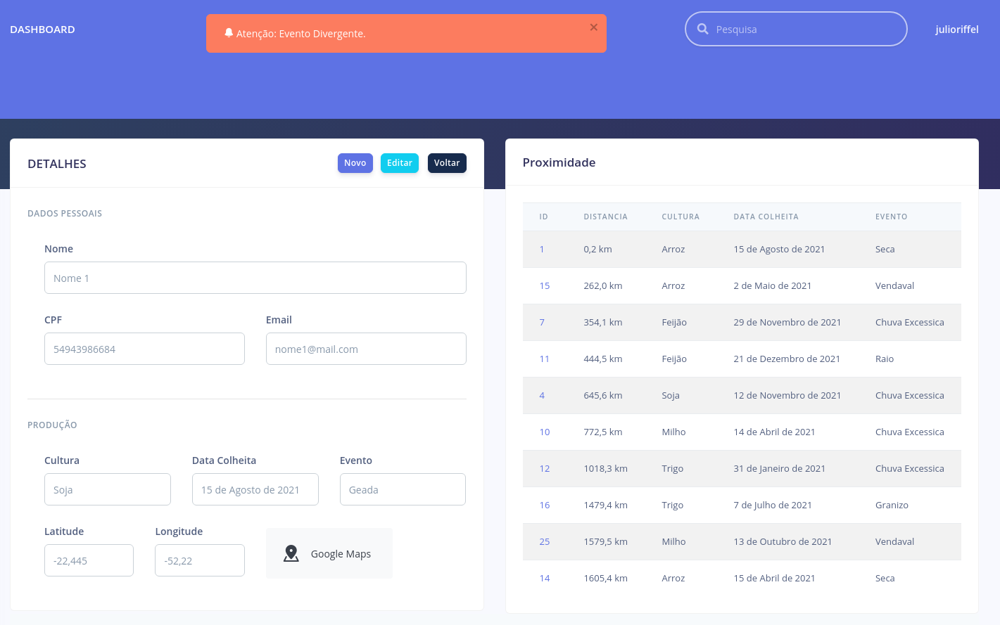
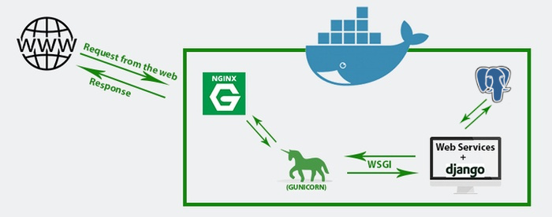
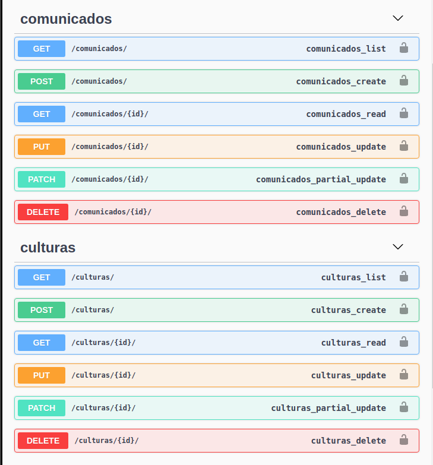

  | **Este projeto está em execução em [link](http://104.131.20.162:8080/) Usuario:user
Senha:user4567** |

# Desafio Softfocus

## Web Developer Python - Pleno

O Proagro Fácil é um sistema da Softfocus que facilita o gerenciamento de Proagro (Programa de Garantia da Atividade
Agropecuária). O Proagro é um programa administrado pelo Banco Central do Brasil, que visa exonerar o produtor rural de
obrigações financeiras relativas a operações de crédito, em casos de ocorrência de perdas nas lavouras. Estas perdas
podem ser ocasionadas por fenômenos naturais, como chuva excessiva, geada, granizo, etc.

No Proagro Fácil, uma das principais etapas para a solicitação de Proagro é o cadastro da comunicação da perda ocorrida,
onde o analista de Proagro irá informar os dados sobre o produtor rural, sobre a lavoura e sobre o evento que provocou a
perda. É muito importante que essas informações sejam preenchidas corretamente para que o produtor tenha o benefício
aprovado.

Neste desafio, você irá criar uma versão simplificada da comunicação de perda.

### Critérios essenciais

1. :heavy_check_mark: A solução deve ser desenvolvida em Python (utilize o framework de sua preferência);
2. :heavy_check_mark: A solução deve possibilitar o cadastro, visualização, atualização e exclusão de uma comunicação de
   perda;
3. :heavy_check_mark: Crie a interface Web com o framework que desejar;
4. :heavy_check_mark: Os dados devem ser salvos em um dos banco de dados: Postgres, MySQL, MongoDB ou Firebase;
5. :heavy_check_mark: A comunicação de perda deve ter os seguintes campos:

   a. Nome do produtor rural;

   b. E-mail do produtor rural;

   c. CPF do produtor rural;

   d. Localização da lavoura (latitude e longitude);

   e. Tipo da lavoura (milho, soja, trigo, feijão, etc);

   f. Data da colheita;

   g. Evento ocorrido, sendo os eventos possíveis:

   - i. CHUVA EXCESSIVA

   - ii. GEADA
   - iii. GRANIZO
   - iv. SECA
   - v. VENDAVAL
   - vi. RAIO

6. :heavy_check_mark: Quando o analista estiver cadastrando uma nova comunicação de perda, queremos garantir a
   veracidade do evento informado. Por isso, caso já exista um cadastro no banco de dados, com mesma data, cuja
   localização esteja em um raio de 10km da localização da nova comunicação de perda e for um evento divergente do que
   já consta no banco de dados, o analista deverá ser informado;

7. :heavy_check_mark: O projeto deverá conter validações para que o CPF e e-mail informados sejam válidos (feito em
   Javascript);

8. :heavy_check_mark: Deve ser possível realizar a busca de uma comunicação de perda pelo CPF do produtor (front-end);

9. :heavy_check_mark: O projeto deverá ser disponibilizado em repositório online, como Github, Gitlab, etc;

10. :heavy_check_mark: O repositório deve conter um arquivo README explicando como utilizar o projeto.
11. :heavy_check_mark: Implementar testes automatizados;

### Critérios opcionais

- :heavy_check_mark: Utilizar um framework front-end (Angular, React, Vue, Ember JS, etc);
- :heavy_check_mark: Deixar a comunicação de perda intuitiva e com uma interface agradável também será um diferencial (
  utilização de CSS);
- Fazer deploy do projeto (ex.: Heroku, Surge.sh, Pythonanywhere, AWS, etc)
  e disponibilizar a URL para acesso;
- :heavy_check_mark: Disponibilizar a aplicação em forma de API para consulta e manipulação das comunicações de perda;
- :heavy_check_mark: Disponibilizar a documentação da API (Swagger, Apiary, Document360, etc);
- Qualquer funcionalidade extra será bem-vinda.

## Detalhes:





### Requisitos

- Potgres com extensão Postgis [docs](https://postgis.net/) [imagem docker](https://hub.docker.com/r/postgis/postgis)
- GeoDjango [requisitos](https://docs.djangoproject.com/pt-br/3.2/ref/contrib/gis/install/geolibs/)
  `sudo apt-get install binutils libproj-dev gdal-bin`
- Django REST framework [link](https://www.django-rest-framework.org/)

Opcional (para execução com docker)

- [Docker](https://docs.docker.com/install/)
- [Docker-compose](https://docs.docker.com/compose/)

```shell
git clone git@github.com:julioriffel/Desafio-Softfocus-Proagro-Facil.git
cd Desafio-Softfocus-Proagro-Facil
python3 -m venv venv
source venv/bin/activate
pip install -r requirements.txt -U
```

## Orientações

As variáveis de ambiente para o projeto, como debug e configurações de banco de dados dever ser ajustadas nos
arquivos`.env` `.env.prod`¹ `.env.prod.db`¹

¹=Exclusivo para Docker

### Debug Local

```shell
cp .env.example .env
python manage.py migrate
python manage.py createsuperuser
python manage.py runserver
``` 

*Requer banco de dados Postgis

Disponivel em: [http://localhost:8000](http://localhost)

### Docker

Para executar django em produção é necessário rodar com **Gunicorn** e usar **Nginx** como proxy reverso para dar mais
segurança ao aplicativo.



Fluxo:`O navegador da Web faz uma solicitação que vai primeiro para o Nginx (servidor proxy), o Nginx atua como um proxy e envia essa solicitação para o Gunicorn (servidor Http python). O Gunicorn recebe isso e se comunica com o aplicativo da web por meio de uma interface chamada interface de gateway do servidor da web (WSGI).`

Requer `docker + docker-compose` e a porta `80` disponível

```shell
cp .env.prod.example .env.prod
cp .env.prod.db.example .env.prod.db
docker-compose up -d [--build]
docker-compose exec web python manage.py migrate
docker-compose exec web python manage.py createsuperuser
docker-compose exec web python manage.py loaddata fixtures/proagro.json
```

Disponivel em: [http://localhost](http://localhost)

## Deploy

### Google App Engine Standard

Requer [SDK](https://cloud.google.com/sdk/docs/install?hl=pt-br) do GCP

```shell
cp app.yaml.example app.yaml
#Ajustar configuraçoes de DB no app.yaml
gcloud app deploy
```

[Documentação](https://cloud.google.com/python/django/appengine?hl=pt-br)

Este projeto não é compativel com Google App Engine **Standard** pois o GeoDjango requer os pacotes da
plataforma `libgdale`
`gdal-devel` não instaladas neste ambiente. Como alternativa é possivel realizar o deploy
no [Google App Engine Flex](https://cloud.google.com/python/django/flexible-environment?hl=pt-br)

### Api

A documentação da API foi gerada no formato OpenAPI, com a
biblioteca [drf-yasg](https://drf-yasg.readthedocs.io/en/stable/). A qual provê interfaces (swagger e redoc) para
visualizar a documentação e interagir com os endpoints.

Exemplo da documentação dos endpoints API, acessível em `swagger/`.


:exclamation: Api Publica (autenticação pendênte) :exclamation:
### Testes

```shell
python manage.py test
```

Cobertura de Teste com `coverage`

```shell
pip install coverage
coverage run manage.py test
coverage report #Exibir no Terminal
coverage html #Gerar Detalhes em Html
google-chrome htmlcov/index.html #Abrir relatório no Google chrome
```

```shell
Name                                            Stmts   Miss  Cover
-------------------------------------------------------------------
api/__init__.py                                     0      0   100%
api/api_docs.py                                     8      0   100%
api/apps.py                                         4      0   100%
api/migrations/__init__.py                          0      0   100%
api/serializers.py                                 25      0   100%
api/tests/__init__.py                               0      0   100%
api/tests/test_comunicado.py                      100      0   100%
api/tests/test_cultura.py                          61      0   100%
api/tests/test_serializer.py                       18      0   100%
api/urls.py                                         7      0   100%
api/views.py                                       14      0   100%
conta/__init__.py                                   0      0   100%
conta/admin.py                                      1      0   100%
conta/apps.py                                       4      0   100%
conta/forms.py                                     11      0   100%
conta/migrations/__init__.py                        0      0   100%
conta/models.py                                     1      0   100%
conta/tests/__init__.py                             0      0   100%
conta/tests/tests_view.py                          27      0   100%
conta/urls.py                                       3      0   100%
conta/views.py                                     23      0   100%
core/__init__.py                                    0      0   100%
core/settings.py                                   31      0   100%
core/urls.py                                        7      0   100%
proagro/__init__.py                                 0      0   100%
proagro/admin.py                                    3      0   100%
proagro/apps.py                                     4      0   100%
proagro/forms.py                                    8      0   100%
proagro/migrations/0001_initial.py                  9      0   100%
proagro/migrations/0002_alter_cultura_nome.py       4      0   100%
proagro/migrations/__init__.py                      0      0   100%
proagro/models.py                                  49      0   100%
proagro/templatetags/__init__.py                    0      0   100%
proagro/templatetags/urlparams.py                  11      0   100%
proagro/tests/__init__.py                           0      0   100%
proagro/tests/test_form.py                         66      0   100%
proagro/tests/test_model.py                        51      0   100%
proagro/tests/test_view.py                        104      0   100%
proagro/urls.py                                     4      0   100%
proagro/util_proagro.py                            15      0   100%
proagro/views.py                                   58      0   100%
-------------------------------------------------------------------
TOTAL                                             731      0   100%
```

### Outras referências:

[Template Argon](https://github.com/creativetimofficial/argon-dashboard-django)